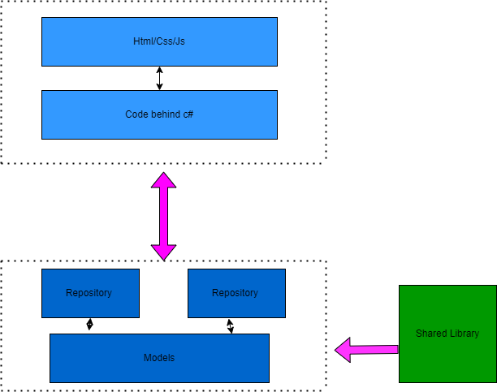

# Car Rental

Ths is demo for Technical Job interview for Ferchau

## Author

- [@Amin-KB](https://github.com/Amin-KB)

## How to Run
### Requirement 
**Database:** sql server express
 
**Runtime:** .Net 8
 
after cloning github repository
 
**first:** run the sql script data/carRentalSql.sql 
 
**second:** after database please copy the connectionstring Backend/appsettings.json
 
**third:** start the backend and frontend separately either by your IDE or by dotnet cli
## Tech Stack
**Database:** sql server express

**Backend:** Asp.net web Api, Entity framework core (ORM)

**Frontend:** Blazor WebAssembly Standalone app

### Database
I have chosen to use sql server server for two main reason.
 
**First:** in the task it was mentioned that i must normalize the data base so it meant i have to use a relational database
 
**Second:** sql server is the most popular relational database management system to use in .Net development.
 
 
Here is the Columns Diagram
 
 

 
 
 
And in case of query optimization for this relational database i indexed my tables
### Backend (Web Api)
I used Asp.net web api because it is very popular enterprise backend solution and i am very comfortable and experienced to work with 

here are the Dependencies
 
Microsoft.EntityFrameworkCore: "8.0.0"
 
Microsoft.EntityFrameworkCore.Design: "8.0.0"
 
Microsoft.EntityFrameworkCore.SqlServer: "8.0.0"
 
Microsoft.EntityFrameworkCore.Tools: "8.0.0"
 
AutoMapper: "13.0.1"
 
 
 
**Design Pattern:**
 
**Repository Pattern**: for design pattern I implemented Unit of Work and Repository Pattern
because I believed it was the fastest pattern to implement for the time constraint of max 4 hours and I believe it is right pattern for simple Crud operations
the reason I have chosen this pattern by implementing repository pattern it provides good abstraction between data access and  the business logic layer of an application
It is a data access pattern that prompts a more loosely coupled approach to data access
 
**Unit Of Work**:The Unit of Work holds all the entities involved in a Business logic into a single transaction and either commits the transaction or rolls it back.
 
 
 

 
**ORM:**
 
**Entity Framework core**: I used EF as my ORM in this project. first it is the most common used ORM in .NET however for many years I was against using EF because of performance issues that it had
that is I used to use Dapper as my ORM because it was more performant than EF and I had more control over my Queries but since EF 7 
it became almost as fast as Dapper

**Auto Mapper:**: I used Auto Mapper for mapping my entities and dtos ! I use Data Transfer objects to transfer Data between
my application layers

### Frontend (Wasm)

for frontend I implemented a blazor wasm standalone app because I can share code between my backend and frontend and it helps me to create a concept GUI
as fast as possible! 

here are the Dependencies
 
MudBlazor: "6.17.0"
 
 
 
 
**Design Pattern:**

Like backend I used **Repository Pattern** but not **Unit Of Work** because I already decoupled my html/css and my c# code behind
and for my data access layer in my frontend I implemented repositories and my models inherit from shared Library as my dtos in my backend.
 
 
 
